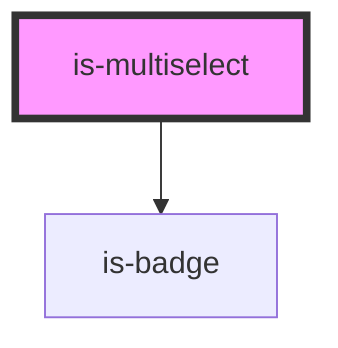

# is-multiselect

<!-- Auto Generated Below -->

## Properties

| Property            | Attribute             | Description                                                                                 | Type            | Default                                                              |
| ------------------- | --------------------- | ------------------------------------------------------------------------------------------- | --------------- | -------------------------------------------------------------------- |
| `disabled`          | `disabled`            | If `true`, the user cannot interact with the select.                                        | `boolean`       | `false`                                                              |
| `items`             | --                    | The options list items.                                                                     | `ISelectItem[]` | `[]`                                                                 |
| `labelSelected`     | `label-selected`      | The label when option is selected.                                                          | `string`        | `'\u2713'`                                                           |
| `labelTo`           | --                    | The label to remove or select.                                                              | `ILabelTo`      | `{     remove: 'Click to Remove',     select: 'Click to Select'   }` |
| `limit`             | `limit`               | Limit the display of selected options. The rest will be hidden within the limitText string. | `number`        | `3`                                                                  |
| `limitText`         | --                    | Function that process the message shown when selected elements pass the defined limit.      | `Function`      | `(count: number) => 'and ' + count + ' more'`                        |
| `max`               | `max`                 | Maximum selected items can be selected.                                                     | `number`        | `undefined`                                                          |
| `placeholder`       | `placeholder`         | The text to display when not selected items.                                                | `string`        | `"Pick some"`                                                        |
| `selected`          | --                    | The selected items.                                                                         | `ISelectItem[]` | `[]`                                                                 |
| `showSelectedBadge` | `show-selected-badge` | If `true`, The badges will show selected items.                                             | `boolean`       | `false`                                                              |

## Events

| Event        | Description                                  | Type               |
| ------------ | -------------------------------------------- | ------------------ |
| `onSelected` | Emitted when the selected items has changed. | `CustomEvent<any>` |

## Methods

### `getSelected() => Promise<ISelectItem[]>`

Get the selected items.

#### Returns

Type: `Promise<ISelectItem[]>`

## Dependencies

### Depends on

- [is-badge](../badge)

### Graph

----------------------------------------------

*Built with [StencilJS](https://stenciljs.com/)*
